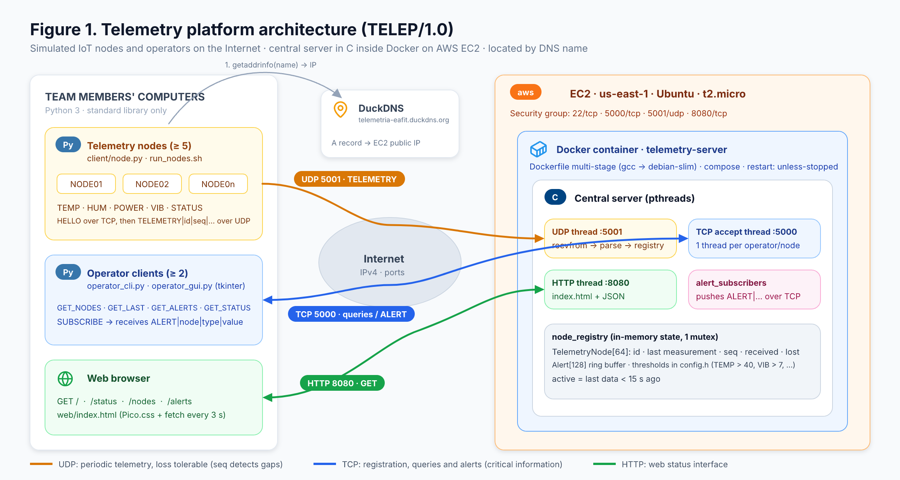
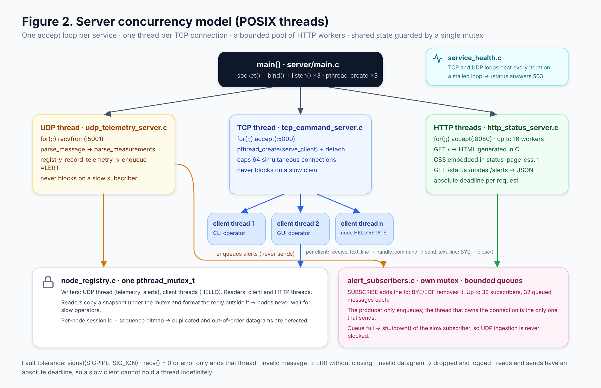
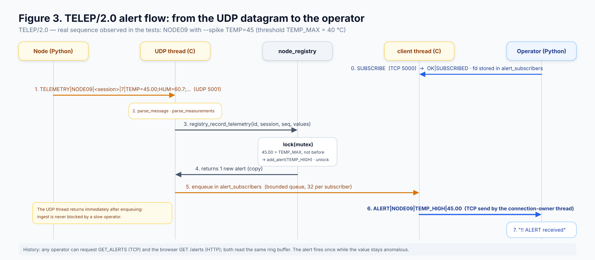
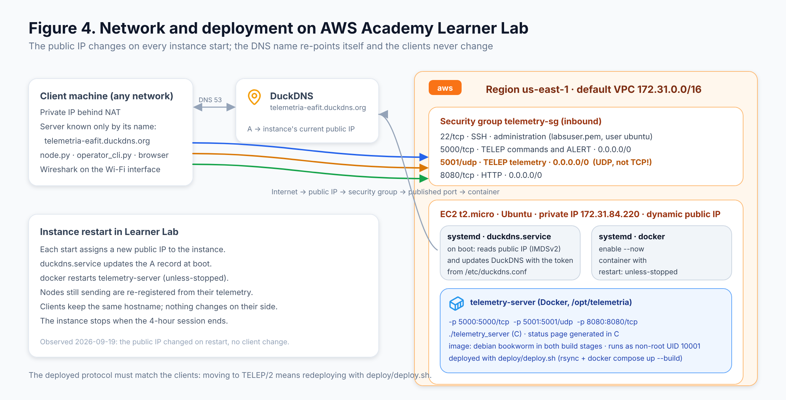

# Plataforma distribuida de telemetría y gestión de infraestructura inteligente

## 1. Portada

**Asignatura:** Telemática / Internet: Arquitectura y Protocolos  
**Semestre:** 2026-2  
**Docente:** [PENDIENTE: nombre del docente]  
**Institución:** [PENDIENTE: nombre de la institución]  
**Integrantes y roles:**

| Integrante | Rol y contribución verificable |
|---|---|
| [PENDIENTE: integrante 1] | [PENDIENTE: rol y contribución] |
| [PENDIENTE: integrante 2] | [PENDIENTE: rol y contribución] |
| [PENDIENTE: integrante 3] | [PENDIENTE: rol y contribución] |

**Fecha de entrega:** [PENDIENTE: fecha]  
**Repositorio privado o acceso acordado con el docente:** [PENDIENTE: enlace y visibilidad confirmada]  
**Commit final presentado:** [PENDIENTE: SHA del commit final]

## 2. Introducción y descripción del problema

El monitoreo de instalaciones distribuidas requiere recibir mediciones periódicas, consultar el estado de cada dispositivo y reconocer condiciones anómalas sin depender de que todos los participantes compartan una red local. Este proyecto simula dispositivos de infraestructura inteligente mediante nodos que generan temperatura, humedad, consumo energético, vibración y estado operativo. Un servidor central procesa la telemetría, conserva el estado reciente y permite que operadores consulten dispositivos y alertas.

La solución integra un protocolo propio de capa de aplicación con sockets TCP y UDP, resolución por DNS, concurrencia, un servicio HTTP de consulta y una arquitectura preparada para ejecutarse en Docker sobre una instancia de nube. El propósito técnico es relacionar el formato de los mensajes con su transporte, direccionamiento, resolución del nombre y observación del tráfico. Las afirmaciones sobre funcionamiento externo y despliegue de la versión final se incorporarán únicamente con las evidencias descritas en las secciones 7 a 9.

## 3. Arquitectura del sistema

El sistema tiene cuatro componentes: nodos simulados en Python, servidor central en C, clientes de operador en Python y servicio web HTTP servido por el proceso central. Los nodos envían mediciones por UDP al puerto 5001; el registro, los reportes de envío y las consultas utilizan TCP en el puerto 5000; la página y los recursos de estado usan HTTP en el puerto 8080. Los clientes reciben un nombre de servidor configurable y lo resuelven mediante DNS.

**Figura 1. Arquitectura general.** Muestra la separación entre la telemetría UDP, el plano de control y consultas TCP y la visualización HTTP. El diagrama representa el diseño del sistema; la comprobación de conectividad exterior corresponde a las pruebas de la sección 9.

**Figura 2. Concurrencia del servidor.** El proceso dispone de hilos de servicio para TCP, UDP y HTTP. Cada conexión TCP tiene un hilo propietario de sus respuestas y alertas, mientras el estado compartido se protege con un mutex. Las alertas se depositan en colas acotadas para evitar que la escritura a un operador lento detenga la recepción UDP.

**Figura 3. Flujo de alertas.** Tras validar un datagrama y detectar el cruce de un umbral, el servidor registra la alerta y la encola para los operadores suscritos. La respuesta de una consulta y una alerta completa salen por el hilo propietario de la conexión TCP, sin intercalar bytes de mensajes distintos.

**Figura 4. Topología de despliegue.** Relaciona el nombre DuckDNS, la instancia EC2, el contenedor y los puertos publicados. Es un diagrama de arquitectura; los datos de la instancia, el contenedor efectivo y el acceso externo de la versión final se completarán con la evidencia de la sección 7.

## 4. Diseño y especificación del protocolo TELEP/2.0

TELEP/2.0 es un protocolo textual propio. Sus tramas contienen campos separados por `|`, pares `clave=valor` y, cuando corresponde, varias mediciones separadas por `;`. Cada trama termina en salto de línea; un datagrama UDP transporta una sola trama. La implementación limita las tramas a 1024 bytes incluido el terminador y rechaza campos vacíos, mediciones duplicadas, variables desconocidas y datos numéricos no finitos. Su especificación completa se encuentra en [PROTOCOL.md](PROTOCOL.md).

El identificador de nodo admite de 1 a 15 caracteres alfanuméricos, guion o guion bajo. La sesión se representa mediante 32 caracteres hexadecimales minúsculos y diferencia las ejecuciones de un mismo nodo. La secuencia UDP va de 0 a 65535. El servidor vincula un ID a una sesión durante la vida del proceso: repetir `HELLO` con la misma sesión es idempotente, pero intentar ocupar ese ID con otra sesión produce `ID_IN_USE`.

**Tabla 1. Mensajes principales de TELEP/2.0.** El transporte responde al tipo de operación: control y consulta por TCP; medición periódica por UDP.

| Mensaje | Transporte | Función | Respuesta o efecto |
|---|---|---|---|
| `HELLO|id|session` | TCP | Registrar la sesión de un nodo | `OK|REGISTERED` o error |
| `TELEMETRY|id|session|seq|mediciones` | UDP | Informar variables periódicas | Actualización del registro; sin respuesta UDP |
| `REPORT|id|session|attempts|sent|omitted|send_errors|final` | TCP | Informar conteos del emisor | `OK|REPORTED` o error |
| `GET_STATUS` | TCP | Consultar resumen del proceso | Línea `OK|clave=valor;...` |
| `GET_NODES`, `GET_LAST|id`, `GET_ALERTS` | TCP | Consultar nodos, mediciones y alertas | Respuestas `OK` y, según el caso, lista terminada en `END` |
| `STATS` o `STATS|id` | TCP | Consultar estadísticas por sesión | Lista de estadísticas terminada en `END` |
| `SUBSCRIBE`, `BYE` | TCP | Recibir alertas o terminar la conexión | Confirmación `OK` |

Los errores TCP tienen el formato `ERR|código|nombre`. La implementación define `100 BAD_FORMAT`, `101 UNKNOWN_CMD`, `102 UNKNOWN_NODE`, `103 TOO_LONG`, `104 SERVER_FULL` y `105 ID_IN_USE`. Un datagrama UDP inválido se descarta y se contabiliza según su causa; no se responde con un error UDP.

**Intercambio TCP observado:** [PENDIENTE: pegar solicitud y respuesta reales, con fecha, ID, sesión y referencia a captura o log].  
**Intercambio UDP observado:** [PENDIENTE: pegar trama real con ID, sesión, secuencia y mediciones; indicar paquete de captura].

UDP es adecuado para mediciones periódicas porque la aplicación puede seguir con una muestra posterior si se pierde una anterior. TCP se emplea en registro, consultas y reportes porque proporciona un flujo ordenado y confiable mientras la conexión está activa. Esta garantía de transporte no equivale a persistencia de las alertas ni a confirmar que un operador las vio; por ello también existe `GET_ALERTS`.

## 5. Implementación de sockets TCP y UDP

El servidor crea sockets IPv4, los vincula a todas las interfaces y escucha conexiones TCP para control y HTTP. `server/socket_helpers.c` contiene la creación, `bind`, `listen`, envío completo con plazo máximo y lectura de líneas con longitud y tiempo acotados. `server/tcp_command_server.c` acepta clientes y asigna un hilo a cada conexión. `server/udp_telemetry_server.c` recibe datagramas con `recvfrom`, valida tamaño, sesión y formato y actualiza el registro. `server/main.c` inicia los tres servicios y evita que `SIGPIPE` termine el proceso ante una desconexión durante un envío.

En Python, `client/telep.py` abre y utiliza las conexiones TCP del operador y del plano de control; `client/node.py` crea el socket UDP y transmite la telemetría con `sendto`. Los clientes incluyen manejo de errores y cierre de recursos. El estado del nodo se identifica por ID y sesión, lo que permite distinguir intentos, envíos locales y recepciones únicas.

**Tabla 2. Relación de puertos y componentes.** Los tres puertos se declaran también en `docker-compose.yml`.

| Puerto | Transporte | Emisor / consumidor | Finalidad |
|---|---|---|---|
| 5000 | TCP | Nodo u operador / servidor | Registro, consultas, reportes y alertas |
| 5001 | UDP | Nodo / servidor | Telemetría periódica |
| 8080 | HTTP sobre TCP | Navegador / servidor | Página y recursos `/status`, `/nodes`, `/alerts` |

**Referencia de ejecución de sockets de la versión final:** [PENDIENTE: captura o log con commit, componentes y conexión real].

## 6. Concurrencia y robustez

La arquitectura separa la recepción UDP, la aceptación TCP y el servicio HTTP. El registro de nodos utiliza sincronización para que las consultas lean un estado coherente mientras ingresan mediciones. Cada conexión TCP tiene un único hilo escritor. En el caso de operadores suscritos, el hilo UDP encola alertas; un consumidor que agota su cola es desconectado. La Figura 2 permite ubicar estas responsabilidades y la Figura 3 muestra el recorrido de una alerta.

El servidor valida mensajes completos y limita tiempos y tamaños de lectura. Las sesiones evitan que un `HELLO` repetido reinicie las estadísticas; los duplicados no reemplazan la última medición y un paquete reordenado puede corregir la estimación de pérdida. El nodo renueva periódicamente su conexión de control y resuelve de nuevo el nombre del servidor. La GUI conserva la ventana y reintenta después de fallos de red, aunque una consulta síncrona todavía puede ocupar el hilo gráfico hasta su timeout.

El archivo `tests/results/functional.json` registra 14 pruebas locales aprobadas el 20 de septiembre de 2026. Ese resultado está asociado a los hashes de la implementación probada antes de los cambios posteriores de interfaz y diagramas; para usarlo como validación de la entrega final debe repetirse con el commit final. No acredita operación en nube ni evaluación visual de la GUI.

**Ensayo de cinco nodos y dos operadores sobre el commit final:** [PENDIENTE: fecha, duración, IDs, clientes, salida y evidencia].  
**Error controlado y recuperación sobre el commit final:** [PENDIENTE: entrada, estado antes/después y evidencia].  
**Prueba visual de la GUI:** [PENDIENTE: equipo, fecha, escenario y captura].

## 7. Despliegue en nube, DNS y Docker

El `Dockerfile` usa una etapa de compilación y otra de ejecución basadas en Debian bookworm; la imagen final ejecuta el servidor como usuario sin privilegios. `docker-compose.yml` publica 5000/TCP, 5001/UDP y 8080/TCP. Los clientes aceptan un nombre de servidor configurable, y los archivos de despliegue incluyen una actualización de DuckDNS basada en la dirección pública consultada desde la instancia. La configuración documentada se encuentra en [DEPLOY.md](DEPLOY.md).

**Tabla 3. Datos de despliegue de la versión final.** Los valores deben provenir de la instancia y del contenedor usados para las pruebas entregadas.

| Dato | Valor / evidencia |
|---|---|
| Plataforma, región, tipo de instancia y sistema operativo | [PENDIENTE: verificar en la consola de nube] |
| Nombre DNS y resultado de resolución | [PENDIENTE: salida fechada de `nslookup` o equivalente] |
| Reglas de acceso 5000/TCP, 5001/UDP y 8080/TCP | [PENDIENTE: captura propia, sin secretos] |
| Commit desplegado e imagen o digest | [PENDIENTE: registrar ambos identificadores] |
| Construcción y contenedor en ejecución | [PENDIENTE: build, `docker compose ps`, puertos y logs] |
| Acceso desde un computador externo | [PENDIENTE: HTTP, TCP y UDP mediante el nombre DNS] |

La Figura 4 debe contrastarse con las salidas reales de esta tabla. Una respuesta HTTP por sí sola no prueba que esa versión se esté ejecutando dentro de Docker. Las credenciales, tokens, claves SSH y datos privados no deben aparecer en el informe ni en las capturas.

## 8. Análisis de tráfico con Wireshark

**Archivo PCAP/PCAPNG original:** [PENDIENTE: nombre, ruta o enlace de la captura propia]  
**Equipo, interfaz, fecha, zona horaria y punto de observación:** [PENDIENTE: datos de la captura]  
**Filtro de captura o visualización utilizado:** [PENDIENTE: filtro real]

**Tabla 4. Paquetes seleccionados.** Se completará con números y valores observados en el archivo original; las IP y los puertos pueden variar según la interfaz o la traducción de direcciones.

| Figura / paquete | Hora | IP origen y destino | Puertos | Transporte y flags | Payload TELEP | Interpretación por capas |
|---|---|---|---|---|---|---|
| Figura 5 / [PENDIENTE] | [PENDIENTE] | [PENDIENTE] | [PENDIENTE] | SYN, SYN-ACK y ACK [PENDIENTE: paquetes reales] | No aplica | [PENDIENTE] |
| Figura 6 / [PENDIENTE] | [PENDIENTE] | [PENDIENTE] | [PENDIENTE] | TCP [PENDIENTE] | [PENDIENTE: solicitud y respuesta reales] | [PENDIENTE] |
| Figura 7 / [PENDIENTE] | [PENDIENTE] | [PENDIENTE] | [PENDIENTE] | UDP [PENDIENTE] | [PENDIENTE: datagrama real] | [PENDIENTE] |

**Figura 5. Establecimiento de conexión TCP.** [PENDIENTE: insertar captura original del handshake y explicar sus paquetes].

**Figura 6. Flujo TCP de consulta y respuesta TELEP.** [PENDIENTE: insertar captura original y explicar encuadre, comando y respuesta].

**Figura 7. Datagrama UDP de telemetría.** [PENDIENTE: insertar captura original y explicar IP, UDP y campos TELEP].

La interpretación final debe relacionar TELEP con la capa de aplicación, TCP o UDP con la de transporte e IP con la de red. Si se usa captura en el equipo cliente, el punto de observación y la posible traducción de direcciones deben quedar explícitos.

## 9. Pruebas y resultados

Las pruebas del código se ejecutan con `tests/run.py` y el escenario de cinco nodos y dos operadores se prepara con `tests/end_to_end.py`. El resultado local conservado en `tests/results/functional.json` es un antecedente verificable de la implementación, pero el registro de la prueba integral de 120 segundos no está presente en la rama actual y la interfaz web cambió después. La siguiente tabla debe completarse sobre el commit que se entregue.

**Tabla 5. Matriz de pruebas de la entrega.** “Observado” y “evidencia” se rellenan con salidas reales, no con el resultado esperado.

| Caso | Entorno y commit | Comando o entrada | Esperado | Observado | Evidencia | Estado |
|---|---|---|---|---|---|---|
| Cinco nodos y dos operadores | [PENDIENTE] | [PENDIENTE] | Cinco IDs activos y dos consultas simultáneas | [PENDIENTE] | [PENDIENTE] | [PENDIENTE] |
| Consulta de nodo, estado y alertas | [PENDIENTE] | [PENDIENTE] | Respuestas TELEP completas | [PENDIENTE] | [PENDIENTE] | [PENDIENTE] |
| Alerta por anomalía | [PENDIENTE] | [PENDIENTE] | Detección y consulta o entrega al operador | [PENDIENTE] | [PENDIENTE] | [PENDIENTE] |
| HTTP `/`, `/status`, `/nodes`, `/alerts` | [PENDIENTE] | [PENDIENTE] | Cuatro respuestas con datos actuales | [PENDIENTE] | [PENDIENTE] | [PENDIENTE] |
| DNS y acceso por Internet | [PENDIENTE] | [PENDIENTE] | Resolución y acceso externo TCP/UDP/HTTP | [PENDIENTE] | [PENDIENTE] | [PENDIENTE] |
| Docker en nube | [PENDIENTE] | [PENDIENTE] | Imagen y contenedor asociados al commit | [PENDIENTE] | [PENDIENTE] | [PENDIENTE] |
| Mensaje incorrecto y desconexión | [PENDIENTE] | [PENDIENTE] | Error controlado y servicio disponible después | [PENDIENTE] | [PENDIENTE] | [PENDIENTE] |
| STATS y omisiones DROP | [PENDIENTE] | [PENDIENTE] | Conteos coherentes por sesión | [PENDIENTE] | [PENDIENTE] | [PENDIENTE] |

**Tabla 6. Contadores UDP por nodo y sesión.** La cantidad “enviados” representa llamadas `sendto` completadas localmente; “únicos” representa secuencias distintas recibidas. La pérdida es una estimación revisable, dependiente del reporte TCP final y del tiempo de espera para datagramas tardíos.

| Nodo / sesión | Intentos | Enviados | Omitidos por DROP | Errores locales | Únicos recibidos | Duplicados | Reordenados | Pérdida estimada | Ventana y drenaje |
|---|---:|---:|---:|---:|---:|---:|---:|---:|---|
| [PENDIENTE] | [PENDIENTE] | [PENDIENTE] | [PENDIENTE] | [PENDIENTE] | [PENDIENTE] | [PENDIENTE] | [PENDIENTE] | [PENDIENTE] | [PENDIENTE] |

La opción `--drop` omite intentos antes de `sendto`; su contador no representa pérdida espontánea en la red. La comparación entre emisor, `STATS`, HTTP y captura debe identificar expresamente esta diferencia.

## 10. Problemas encontrados y soluciones implementadas

**Tabla 7. Cambios técnicos documentados.** Los problemas de despliegue y captura se agregarán cuando exista un registro propio del equipo.

| Problema identificado en la revisión del código | Solución incorporada | Evidencia de implementación o prueba |
|---|---|---|
| Respuestas y alertas podían escribirse sobre una misma conexión TCP desde hilos distintos. | Se asignó un único escritor por conexión y se encolaron las alertas. | `server/alert_subscribers.c`, `server/tcp_command_server.c`, prueba local de dos operadores y alertas en `tests/test_system.py`. |
| Un suscriptor lento podía bloquear el receptor UDP durante el envío de alertas. | Se establecieron colas acotadas y desconexión del suscriptor saturado. | `server/alert_subscribers.c` y prueba local del suscriptor lento. |
| Los huecos de secuencia podían confundirse con pérdida definitiva ante reordenamiento. | Se añadieron sesiones, seguimiento de secuencias únicas y reportes de envío del nodo. | `server/node_registry.c`, `client/node.py`, `STATS` y prueba local de duplicados/reordenamiento. |
| Peticiones HTTP incompletas podían retener la atención de conexiones. | Se incorporaron límites de cabeceras, tiempos y trabajadores acotados. | `server/http_status_server.c` y pruebas locales de cabeceras lentas. |

**Problemas y soluciones observados durante Docker, DNS y despliegue de la versión final:** [PENDIENTE: describir solo incidentes registrados, causa, corrección y evidencia].  
**Problemas durante captura de tráfico o pruebas externas:** [PENDIENTE: completar si ocurrieron].

## 11. Conclusiones

La implementación presenta una separación explícita entre telemetría periódica por UDP y operaciones de control por TCP, con un servicio HTTP adicional para visualizar el estado. El protocolo TELEP/2.0 define identidad de sesión, secuencias, respuestas y errores; la aplicación añade controles de tiempo, tamaño y concurrencia que no proporciona por sí solo el transporte. La medición UDP separa omisiones simuladas, errores locales de envío, recepciones únicas y pérdida estimada.

El resultado local versionado permite describir la validación de partes del sistema, pero las conclusiones de funcionamiento en nube e Internet deben basarse en las pruebas de la versión final, los registros del contenedor y las capturas originales. [PENDIENTE: incorporar resultados finales medidos y límites observados].

**Aprendizaje del integrante 1:** [PENDIENTE: reflexión y contribución personal].  
**Aprendizaje del integrante 2:** [PENDIENTE: reflexión y contribución personal].  
**Aprendizaje del integrante 3:** [PENDIENTE: reflexión y contribución personal].

## Anexo A. Evidencias individuales

### Integrante 1: [PENDIENTE: nombre]

**Usuario, hostname y fecha:** [PENDIENTE]  
**Componente ejecutado y conexión con nube:** [PENDIENTE]  
**Captura propia:** [PENDIENTE: insertar imagen original]  
**Contribución:** [PENDIENTE]

### Integrante 2: [PENDIENTE: nombre]

**Usuario, hostname y fecha:** [PENDIENTE]  
**Componente ejecutado y conexión con nube:** [PENDIENTE]  
**Captura propia:** [PENDIENTE: insertar imagen original]  
**Contribución:** [PENDIENTE]

### Integrante 3: [PENDIENTE: nombre]

**Usuario, hostname y fecha:** [PENDIENTE]  
**Componente ejecutado y conexión con nube:** [PENDIENTE]  
**Captura propia:** [PENDIENTE: insertar imagen original]  
**Contribución:** [PENDIENTE]

## Anexo B. Video de sustentación

**Enlace al video:** [PENDIENTE: URL accesible]  
**Duración:** [PENDIENTE: verificar 15 a 18 minutos]  
**Intervención del integrante 1:** [PENDIENTE]  
**Intervención del integrante 2:** [PENDIENTE]  
**Intervención del integrante 3:** [PENDIENTE]

La grabación debe mostrar ejecución real de arquitectura, protocolo, servidor en nube y Docker, cinco nodos, operador, TCP, UDP, alerta, Wireshark y resultados.

## Anexo C. Referencias y archivos de evidencia

1. Enunciado de la asignatura: `docs/Proyecto Telematica 2026-2.pdf` y copia facilitada por el equipo.
2. Código y especificación: [repositorio del proyecto](https://github.com/jayounghoyos/Proyecto01-Telemetria-Gestion-de-Infraestructura), [PROTOCOL.md](PROTOCOL.md), [ARCHITECTURE.md](ARCHITECTURE.md), [DEPLOY.md](DEPLOY.md).
3. Resultado local conservado: `tests/results/functional.json` [PENDIENTE: repetir con el commit final y adjuntar salida].
4. Captura TCP/UDP original: [PENDIENTE: archivo PCAP/PCAPNG y referencia a Figuras 5–7].
5. Evidencias de nube y Docker: [PENDIENTE: archivos, capturas y fecha].
6. Commit final: [PENDIENTE: SHA y enlace].

## Datos y evidencias pendientes

- Portada: docente, institución, nombres, roles, contribuciones, fecha, visibilidad del repositorio y commit final.
- Dos intercambios TELEP reales para la sección 4 y una evidencia de ejecución de sockets para la sección 5.
- Repetición de la suite y ensayo integral sobre el commit final; prueba visual de la GUI, error y recuperación.
- Datos comprobados de la instancia, DNS, reglas de red, imagen, contenedor, puertos y acceso externo de TELEP/2.0.
- Captura PCAP/PCAPNG original y Figuras 5–7 con números de paquete, hora, IP, puertos, flags y payload observados.
- Matriz de pruebas completa, contadores UDP por sesión, duración y tiempo de drenaje.
- Incidentes reales de despliegue o captura, si los hubo, con solución y evidencia.
- Resultados finales para las conclusiones y aprendizaje individual de los tres integrantes.
- Evidencias originales de cada integrante y enlace al video de 15 a 18 minutos.
